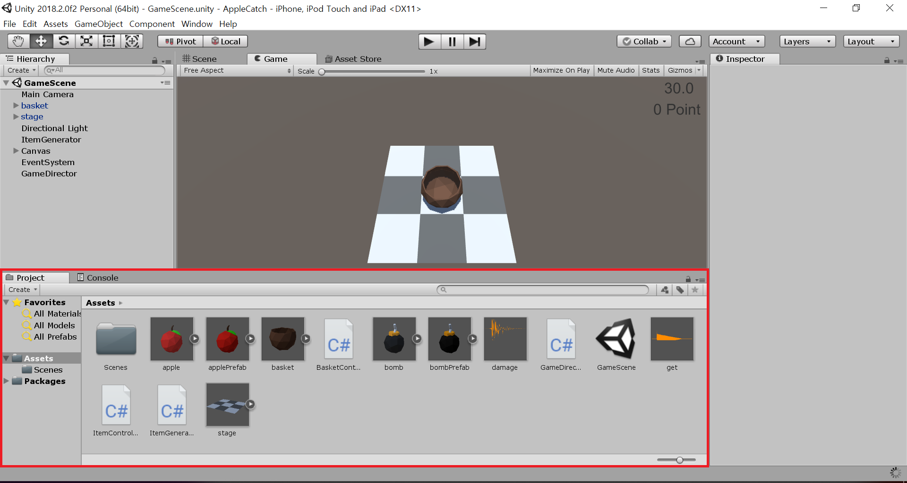
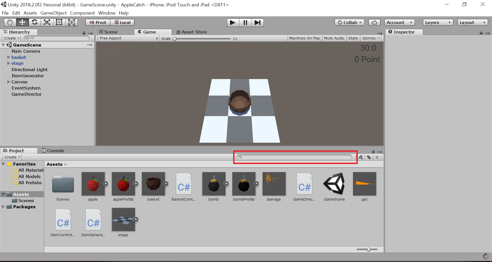
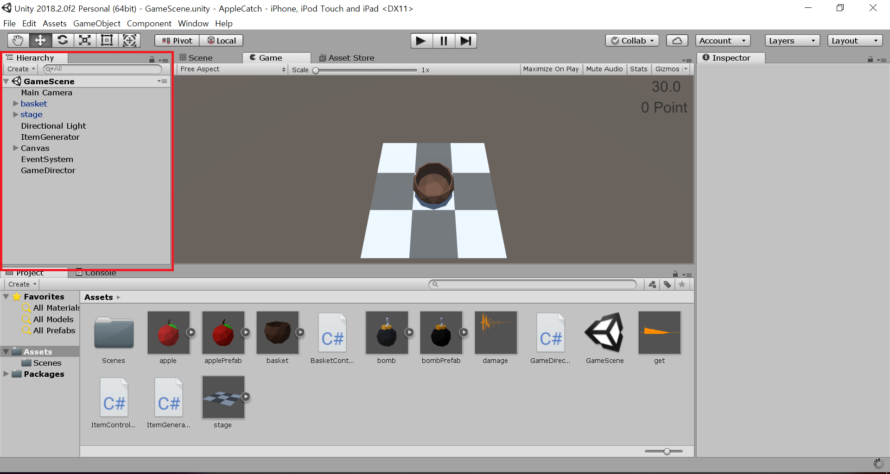
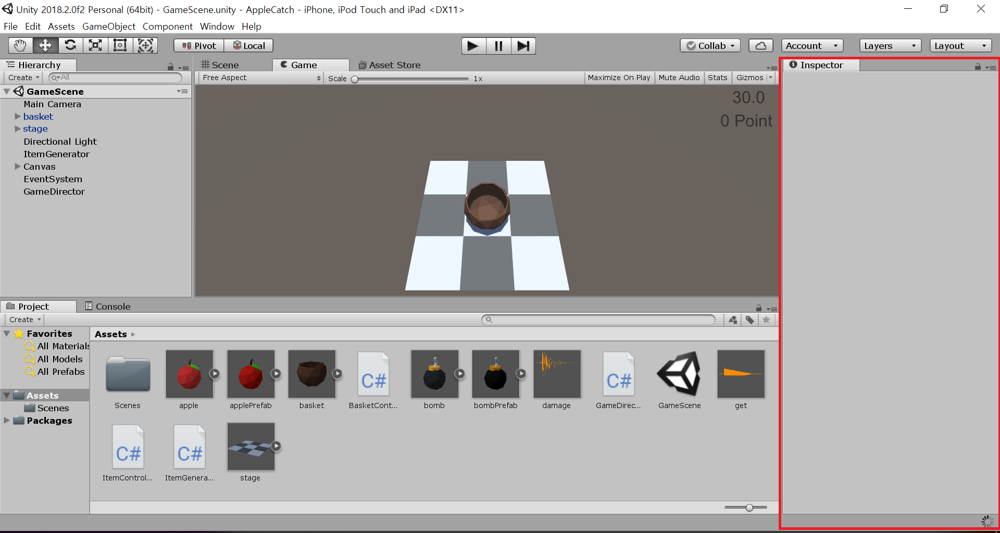
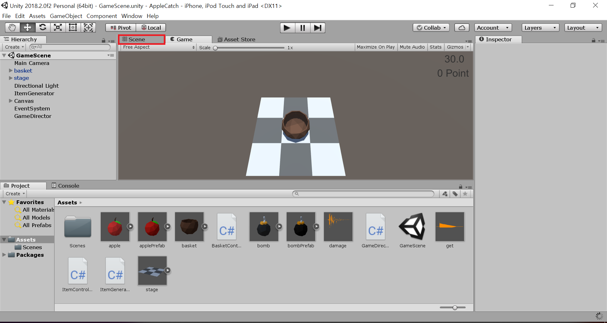
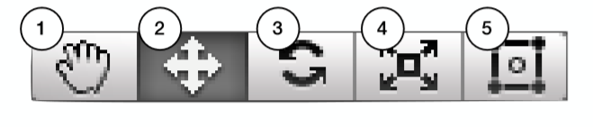
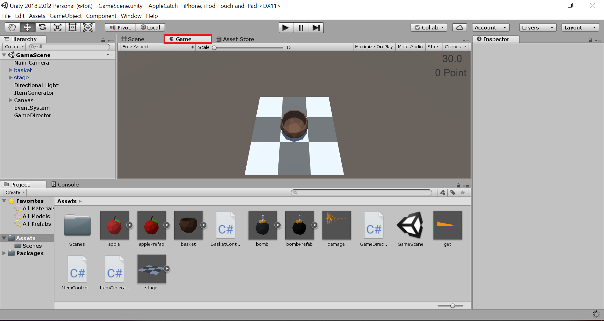
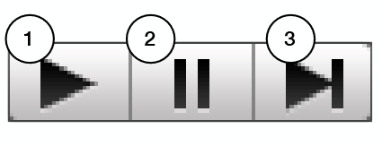

# Chp1 Interface

## Interface

Create Project

	1. New 클릭
	2. Project Name 및 Template( 3D or 2D 설정 ) 설정
	3. Create Project 

기초적인 View 

	 Project View
	 Hierarchy View
	 Inspector View
	 Scene View 
	 Game View 

1. Project View
		

		 게임에 사용되는 Asset들을 관리하는 창 
		 윈도우의 탐색기와 비슷한 역할 
		 다양한 검색 기능
		 폴더 생성 및 Image 파일 불러오기 

* 새로운 폴더 만들기
	
		Asset 창에서 마우스 우클릭 후 Create를 통해서 만듬
		Import를 시키는 경우는 파일을 Drag & Drop을 통해 간단히 넣어줄 수 있음 
* Asset Search 
		
		
			
		어떤 특정한 타입만을 보고 싶은 경우 검색창 오른쪽 버튼( Search By Type )을 통해 특정한 Type만 검색 가능 

2. Hierarchy View
		
		
		 현재 Scene에 사용되는 GameObject를 관리하는 View
		 새로운 GameObject를 생성 / 삭제
		 계층 구조 설정 
	 	 마찬가지로 Hierarchy View에서 오른쪽 버튼을 통해 Object 생성이 가능
		 
* Main Camera

		User에게 어떻게 게임을 보여줄 지 보여주는 Camera
		Z축 잘 볼 것 
* 계층 구조화

		부모 자식 설정 즉, 그룹화와 유사 
		한 Object가 움직이면 같이 움직임
		자식 Object를 부모 Object에 넣으면 자식으로 들어가게 됨
		이 경우, 부모 Object를 움직이면 같이 움직이게 됨
 		Transform 속성을 그대로 따라가게 됨 
		
3. Inspector View
		
		
		현재 선택한 GameObject 또는 Asset의 정보를 보여주는 부분 
		Component 추가 / 삭제 / 변경
		GameObject 이름 / 태그 / 레이어 변경
			
* Transform Inspector

		위치 / 회전 / 크기를 정하는 Inspector
		모든 GameObject가 가지고 있음

* Sprite Renderer Inspector

		Flip 상하좌우 반전
		X -> 좌 / 우 Y -> 상 / 하 반전
		
* Sorting Layer / Order in Layer Inspector

		이미지의 출력 순서 	
		파워포인트의 그림 맨 뒤로 보내기 맨 앞으로 보내기와 유사 
		번호 순서로 Layer를 지정했다 하였을 때 1번 Layer가 가장 아래로 가며 큰 번호일 수록 가장 나중에 그려짐 (맨 위에 있음) 
		같은 Type의 GameObejct인 경우 Sorting Layer가 아닌 Order in Layer를 통해 조절 
		
4. Scene View
				

		실질적으로 게임을 제작하는 공간 
		GameObject를 배치
		
* Scene View Toolbar
				

		1. 씬 뷰 이동 (Q)
		2. 위치 이동 (W)
		3. 물체 회전 (E)
		4. 크기 변경 (R) 
		5. 사각 툴 (T) - 1, 2, 3, 4 모든 기능 제공

* Gizmo	

		Scene View에서 내가 보이게 할 것과 보이지 않게 할 것 설정이 가능 

5. Game View
				

		현재 Scene이 실제로 작동하는 모습을 보여주는 View
		다양한 해상도 Test

* Game View Toolbar
			
		
		1. 게임 재생 (Ctrl + P)
		2. 일시정지 (Ctrl + Shift + P)
		3. 한 프레임 앞으로 (Ctrl + Alt + P)
		
* Maximaze On Play

		재생 시 최대 화면으로 Play시켜 줌
		
* Mute Audio
		
		Play시 Sound Off
