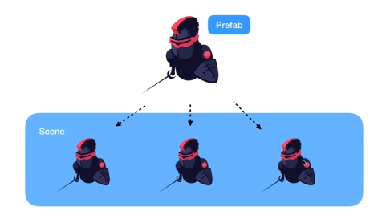

# Chp1 Prefab & Camera

## Prefab

1. Prefab이란 ?
	
	
	 	GameObject를 Assets으로 만들어 놓는 것 
		여러개의 동일한 GameObject를 관리할 때 편리

	* Prefab 만드는 법
		* Prefab을 만들고자 하는 Object를 Assets에 Drag
			* 이 때, Hierarchy View에서 Object이름이 파랗게 변하는 데 Prefab과 연결되어 있음을 의미
			* Prefab을 선택하고 어떤 요소를 변경하면 연결 된 모든 Prefab들이 변경 됨 
			* 각각 Object마다 변경도 가능
			* Prefab의 Select 기능 - 선택한 Object가 어떤 Asset과 연결되어 있는지를 보여줌
			* Revert 기능 - 변경 사항을 취소하고 원래 Prefab 설정으로 돌리는 기능
			* Apply 기능 - 변경 사항을 모든 Prefab에 적용시키는 기능

## Camera

2. Main Camera

	* Background
		* Game Scene의 배경색을 바꿔줌 

	* Projection
		* Perspective
			 원근법을 적용하여 보여줌 
		* Orthographic 
			 원근법을 적용시키지 않고 보여줌
