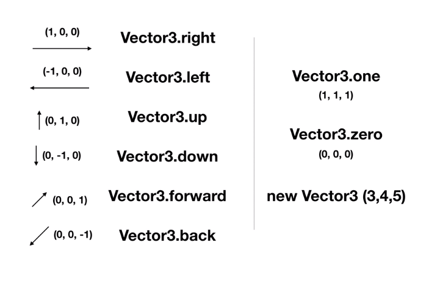

# Chp2 Function & Condition & Vector3

## Function

1. 함수란 ?
		
	* 특정 기능을 수행하는 코드 
	* 함수를 정의한 뒤 이름만 적으면 어디서든 실행 가능 (함수의 편리성)
	

## Condition

1. 조건문

	* 조건문 (if-else문)
	* 논리 연산자 (==, >=, >, <=, <)
	* 산술 연산자 (+, -, *, /, %)	
	* Console View의 Collapse기능 
		* 결과값이 같은 것들을 합쳐서 최신 결과값만을 출력해 줌
		* 해제하면 합치지 않고 모두 표시
	

## Vector3

1. Vector3 ?

	* (x, y, z)로 이루어진 자료의 형태
	* x, y, z의 정점으로부터 크기와 방향을 나타내는 것

	1. 벡터의 연산 
		* 더하기와 빼기가 가능  
		* 벡터끼리의 곱셈은 불가능
		* 벡터에 상수를 곱하는 것은 가능 
		* 또한, 상수를 나누는 것도 가능
		* 상수를 곱하거나 나누는 것은 벡터의 방향은 유지를 하되 크기를 조절할 때 많이 사용

	2. 기본적인 Vector3 함수

		
		* 정의되어 있지 않은 새로운 벡터를 만들 때에는 new Vector3 (x, y, z)를 통해 만들어 줌

