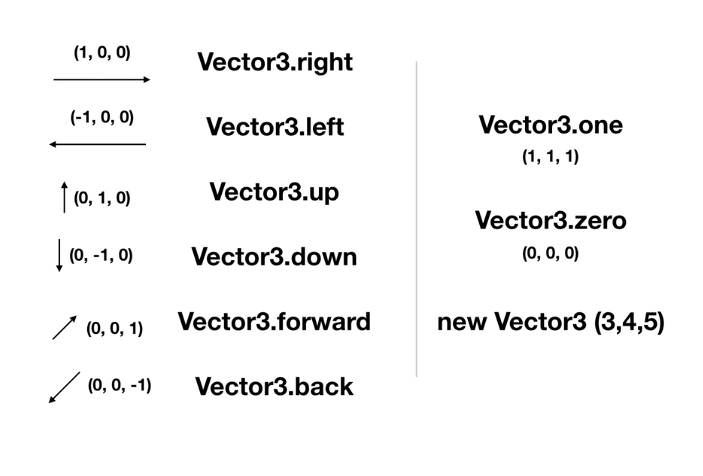

# Chp2 Functions

## Functions

1. 다양한 함수들 (정의되어 있는 함수들)
		
	* Debug.Log
	* Destroy
	* Translate
	* Rotate
	* GetKeyDown
	* Instantiate
	* GetComponent
	
	1. Debug.Log
		
		* Debug.Log("Hello World");
		* 괄호 안의 내용을 Console창에 표시 
	
	2. Destroy
		
		* Destroy(gameObject);
		* 괄호안의 Object를 없앰
		* Destroy(gameObject, 3f);
		* 괄호안의 Object를 몇초 뒤에 없앰, 3f는 3초 뒤를 의미, f는 float를 의미하므로 실수초도 지정 가능
	
	3. Translate	
		
		* transform.Translate(1f, 0f, 0f);
		* 게임오브젝트를 괄호 안의 좌표(x, y, z)만큼 이동시킴  
		* transform.Translate(Vector3.right);
		* Vector3는 x, y, z 모든 좌표를 가지고 있는 자료형
		 
		* 위의 Vector3 함수들을 사용하여 이동시키는 것도 가능하며 추천하는 방법 

	4. Rotate

		* transform.Rotate (0f, 0f, 1f);
		* 게임오브젝트를 괄호 안의 좌표(x, y, z)만큼 회전시킴
		* 또한, 괄호 안에 Vector3도 넣어 줄 수 있음
		* z 좌표의 양의 회전 값은 시계 반대 방향으로 돌아감

	5. GetKeyDown

		* Input.GetKeyDown(KeyCode.Space)
		* 특정 키가 눌리는 순간 true를 반환 
		* 위의 경우, Space가 눌리면 true를 반환

	6. Instantiate

		* Instantiate (gameObject);
		* 괄호 안에 있는 게임오브젝트를 복제 

	7. GetComponent

		* GetComponent<SpriteRenderer>().color = Color.red;
		* GetComponent<컴포넌트 이름>()
		* 현재 게임 오브젝트의 다른 컴포넌트를 가져오는 함수
		* Transform이 아닌 다른 컴포넌트를 가져오기 위해선 꼭, GetComponent를 해야함

2. 이벤트 함수

	* 실행되는 시점이 미리 정해져 있는 함수들
	* Start / Update / OnCollisionXXX
	
	1. void OnCollisionEnter2D(Collision2D col){}
		* Collision 충돌 시 호출되는 함수
		* Parameter는 충돌한 상대방 물체 정보
	2. void OnCollisionStay2D(Collision2D col){}
		* Collision 충돌 중에 계속 호출되는 함수
	3. void OnCollisionExit2D(Collision2D col){}
		* Collision 충돌이 끝나는 순간 호출되는 함수

