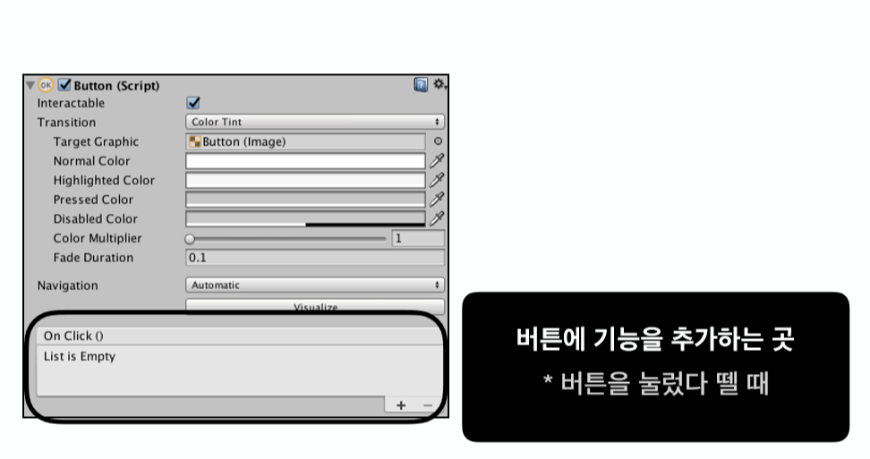
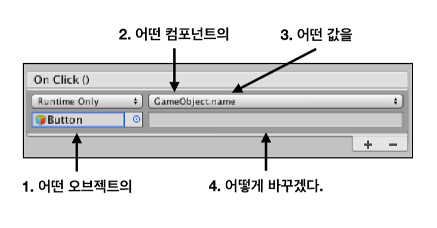

# Chp3 UI

## Button

1. Button
		
	1. Button
		* 모바일 게임의 대표적인 Interaction component
		* Add Component나 UI 생성을 통해서 Button 생성 가능

			버튼은 4가지 상태가 존재
			* Normal - 아무 조작을 안하는 경우
			* Highlighted - 버튼에 마우스가 위로 올라간 경우
			* Pressed - 버튼에 마우스를 누른 경우
			* Disabled - 버튼을 더이상 사용할 수 없는 경우 

		* Button의 Transition - 버튼의 상태전환을 어떻게 표시할 것인가 ? 
			* None : 각 상태마다 변화를 전혀 표시하지 않음
			* Color Tint : 기본값이며 각 상태마다 색깔을 약간씩 변형시킴 
			* Sprite Swap : 상태마다 Image로 표시를 가능케 해줌	
			* Interactable : 상호작용 여부, false(체크 해제)라면 disabled 상태
	
		* C# Script로 UI와 관련된 Script를 작성할 땐 using UnityEngine.UI; 를 항상 사용해주어야 함

	2. On Click()

	
	
	
	* Canvas 계층 View에서 가장 아래에 있으면 가장 앞에 Image를 출력 
	* 따라서, 맨 뒤로 Canvas Image를 보내고 싶으면 보내고자 하는 Image를 계층 맨위로 보냄
	* 계층 구조에서 UI를 누르면 나오는 파란색 공간은 사용자와 Interaction이 가능한 범위 공간
	* Raycast Target 
		* 사용자가 무언가 입력을 주었을 때 그 입력을 받을 것인가 ? 
		* 체크 해제 시, 입력을 받지 않게 됨 
