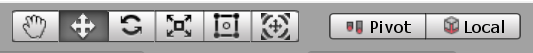

# Chp3 UI

## Canvas

1. 캔버스
		
	1. UI
		* 게임 플레이어가 게임과 상호작용하는 시스템
		* HP 바 , Skill 버튼 등 
	2. uGUI (Unity Graphic User Interface)
	3. Canvas
		* UI를 그리는 공간
		* UI에서 Canvas를 만들면 생성되는 EventSystem은 사용자와 게임 간의 interaction을 관장해주는 역할
		* 모든 UI 요소는 Canvas 자식오브젝트
		* UI가 그려지는 하나의 도화지와 유사 // Main Camera와는 별개임

			1. Canvas Render Mode : Screen Space - Overlay
	
		* 화면 위에 UI를 그리는 모드
		* 카메라 비율, 해상도가 변경되면 자동으로 이에 맞춰짐
		* Canvas의 Position을 움직일 수 없게 됨 
		* Camera와 동떨어진 영역을 가지게 됨
	
	
			2.  Canvas Render Mode : Screen Space - Camera
		
		* GameView에 따라 Canvas의 크기가 변경
		* GameView창의 크기를 줄이면 Canvas의 크기도 줄어듬
		* Render Camera를 Main Camera로 설정하면 Canvas를 Main Camera의 크기로 맞춰 줌
		* Canvas를 카메라에 맞추는 모드 즉, 카메라 설정이 UI에 영향을 줌 
		* Plane Distance는 Camera와 Canvas 사이의 거리 (Z축 거리)
		* Sorting Order 설정 가능
		* Canvas Scaler (Script)
			* UI Scale Mode ( Scale With Screen Size )
			* 기준 해상도(Reference Resolution)를 설정한 후 (기준점) Display 옆의 해상도를 통해 해상도를 바꾸게 되면
			   Canvas 해상도가 기준 해상도에 맞춰서 바뀜
			*  Match가 왼쪽으로 설정되어 있으면 처음 Width로 고정
			*  Match가 오른쪽으로 설정되어 있으면 처음 Height로 고정	

			3. World Space

		* Scene에 있는 다른 Object처럼 동작하는 모드 
	
			4. Layout (Rect tool)
	
		
	
		* UI 요소를 이동, 크기 조절, 회전하는 데 사용
		* Pivot 모드 
			* 물체의 중점을 옮길 수 있음
		* Center 모드
			* 중점을 옮길 수 없으며 항상, 가운데 셋팅
		* Local 모드
			* 물체의 회전과 맞춰 X축 Y축의 방향이 결정이 됨 
		* Global 모드	
			* 물체를 회전 시켜도 X축은 무조건 오른쪽 Y축은 무조건 세로로 결정

2. Layout - Rect Transform
	
	* 기존 Transform 컴포넌트 대신 UI에 사용되는 Transform 컴포넌트
		
	1. Anchors (앵커)
		* UI의 부모에 대한 고정 오프셋
		* 부모 사각형의 폭과 높이에 대한 비율로 정의	
	2. Pos X, Pos Y
		* 앵커에 대한 피벗 포지션
		* 이 Pivot이 앵커에 대해서 얼마만큼 떨어져 있는가 ? 
	3. Width, Height	
		* 물체의 폭과 높이

	4. 앵커가 떨어져있는 경우
		

3. Text
	
	* Text를 쓸 때에는 Inspector의 Text (Script)부분에 작성
	* Alignment : Text의 정렬 위치
	* Horizontal Overflow : 텍스트가 사각 영역의 가로(Width) 보다 클 경우의 옵션
		1. Wrap : 가로영역을 넘어갈 경우 자동으로 Enter를 친 결과를 출력
		2. Overflow : 가로영역을 넘어가도 계속 연결된 Text 출력
	* Vertical Overflow
		1. Truncate : 세로영역을 넘어갈 경우 넘어간 세로 영역 Text는 잘라버림
		2. Overflow : 세로영역을 넘어가도 넘어간 세로 영역 Text 모두 출력
	* Best Fit
		* 우리가 원하는 최적의 사이즈로 Font-Size를 맞춰 줌
	* Outline Component
		* 표시하고 있는 UI에 테두리를 적용시켜 줌

4. Image	
	
	* Canvas에 그림을 그려주는 UI Component (Image Type이 굉장히 중요함)	
	* Preserve Aspect : Image가 잘리거나 하지 않고 비율이 유지된 채로 Image가 표시 됨
	* Image Type
		1. Simple : 단순히 표시 
		2. Sliced : 동영상 참조 
		3. Tiled : Image 내부를 바둑판식 배열로 채움
		4. Filled    
			1. Fill Amount 옵션을 통해 Image내부를 채움 ( 스킬 쿨타임이나 체력 바 )
			2. Fill Origin 옵션을 통해 Image내부를 채우기 시작할 방향을 설정할 수 있음
		  
