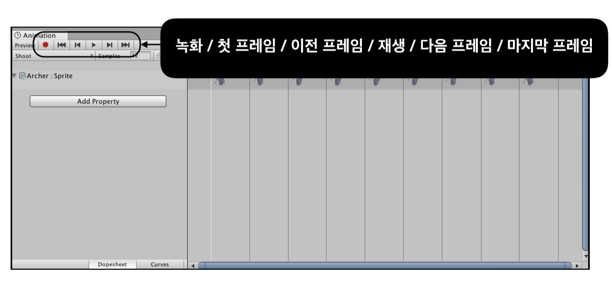

# Chp4 Animation

## Animation System

1. Animation System 
		
	1. Animation
		* 일을 하는 Object들의 동작
		* Animator Component
			* Animator Controller - 애니메이션 상태를 컨트롤 해주는 Asset
		* Animator State
			
		* Animator Transition
			
		* Animation State의 Inspector 
			* Motion -> Animation Clip을 지정해 줄 수 있음

2. Animation Clip
		* 하나의 동작을 저장하고 있는 Asset
	
		

		
		
		

		
	
<hr/ >

