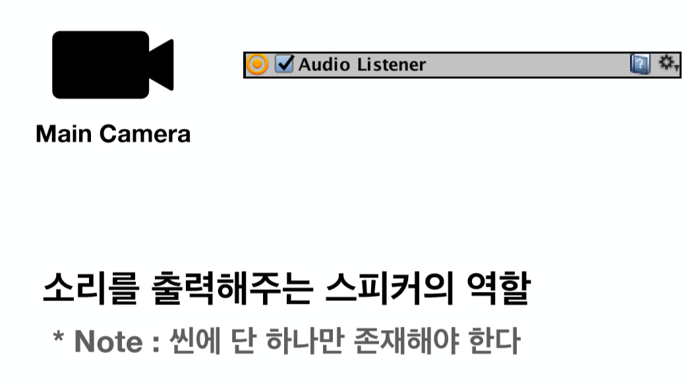

# Chp5 Others

## Audio

1. Audio
		
	* 최적화가 중요
	* Audio Source Component
		* Unity에서 다양한 소리(Audio Clip)를 재생시켜주는 Component

	* Audio Listener Component
		* 그 다양한 소리(Audio Clip)를 듣는 Player 역할을 해주는 Component
			
	* Audio Clip Inspector 
		* Force To Mono - 오디오 단일 채널 여부 (대부분의 모바일 게임은 단일 채널로 사용하므로 체크하는 경우가 많음)
		* Check시 용량이 줄어드므로 최적화 효과를 볼 수 있음
		* 스테레오가 더 중요하다면 체크 해제
		* Load Type - 게임 실행중 오디오 애셋을 로드하는 방식
			1. Decompress On Load 
				* 메모리에 모든 Audio Assets을 풀어놓겠음을 의미 
				* 메모리를 많이 차지하지만 재생 시 성능 오버헤드가 적음
				* 재생 빈도가 많은 것(효과음)
			2. Compressed In Memory
				* 메모리에 압축되어 있다
				* 배경음악의 경우 Compressed In Memory와 Streaming 옵션을 많이 사용
				* 재생 빈도가 적은 것 
			3. Streaming 
				* 내가 재생하고자 하는 부분만 압축을 해제하여 틈
				* 가장 메모리를 적게 차지하지만 성능 오버헤드가 가장 큼 
		* Compression Format - 게임 실행중 오디오 애셋의 압축형식
			1. PCM - 압축을 거의 하지 않음 // 용량이 큰 대신, 음량 품질이 좋음 (효과음) 
			2. Vorbis - 압축을 많이 하겠음을 의미 (배경음)

		* Quality - 압축을 얼마만큼 할 건지 정함 // 클수록 음량 품질이 떨어짐

2. Audio Source
	
	* Hierarchy View에서 Create -> Audio -> Audio Source를 통해 만듬
	* Mute - 음소거 역할
	* Bypass Effect - Audio Source 효과
	* Bypass Listener Effects - Listener 효과 
	* Bypass Reverb Zone - Reverb(울림)를 적용해주는 역할 // 노래방 Reverb와 비슷
	* Play On Awake 
		* 현재 Audio Source가 시작 될 때 맨 처음에 Play를 하면서 시작할 지의 여부를 판단하는 역할
		* EX) 배경음악
	* Loop - 현재 Audio가 끝나면 반복 재생을 할건지에 대한 여부를 판단하는 역할
	* Play 함수를 통해서 Audio Source를 실행시킴 
	* Stop 함수 - 정지하면 맨 처음으로 돌아감
	* Pause 함수 - 일시정지
	* UnPause 함수 - 일시정지 해제 
	
3. Audio Listener

	* Main Camera에 자동으로 포함되어 있음
	
	* 게임 캐릭터에도 적용이 가능 - EX) 캐릭터가 가까워지면 소리가 증가 OR 멀어지면 감소
	* 3D Sound Settings에서 거리에 따라 소리를 조절하는 Setting이 가능
	* 거리에 따라 소리를 조절할 경우에는 Spatial Blend를 1로 해야 함 		

