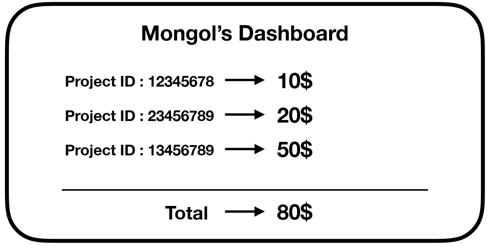

# Chp5 Others

## Unity Ads & Apk

1. Unity Ads

	* 게임의 수익화와 관련 된 내용 (Unity 광고)
	* Unity는 기본적으로 동영상 광고 (Android나 IOS인 모바일 환경에서 실행이 됨)
	* 광고주는 Unity Ads를 제공하게 해준 Unity에 댓가를 지불
	* Player는 개발자가 만든 광고를 보고 게임 화폐 등을 지급 받음
	* 개발자는 광고를 본 Player들에게 게임 화폐 등을 지급한 후 Player로 부터 광고시청 결과를 콜백( Skip OR 전부 다 봄)
	* 게임마다 각각의 ProjectID가 주어지며 Dashboard를 통해 각각 게임마다 수익이 얼마나 쌓인지를 확인할 수 있음
	

 	* Unity 광고의 종류
		1. Simple Ads
			* 유저의 의도와 관계없이 출력
			* 스킵 가능
			* 수익성 낮음

		2. Reward Ads
			* 유저가 원해서 시청
			* 스킵 불가능
			* 수익성 높음 
	
	* Window -> General -> Services를 통해 설정 가능
	* 광고와 관련하여선 스크립트에 using UnityEngine.Advertisements; 사용해주어야 함 
	* 광고를 설정 후 게임을 실행하면 (ProjectID, Test 광고인지의 여부)로 초기화가 실행 // Console창에 출력 됨

2. Apk
		
	* Android packages의 약자
	* 추후 수정 할 예정이지만 직접 해보면서 이해하는게 더 좋을 것 같음 

## Background Scrolling

1. Background Scrolling ( 배경 )
	
	* 도착점이 없는 Running 게임 같은 경우 캐릭터보다 배경을 움직이는 형식을 만들게 됨
	* 따라서, Script를 통해 Speed를 설정해 줌으로서 Background Scrolling을 가능케 함
	* package만 받아 간단하게 사용할 수 있음 
